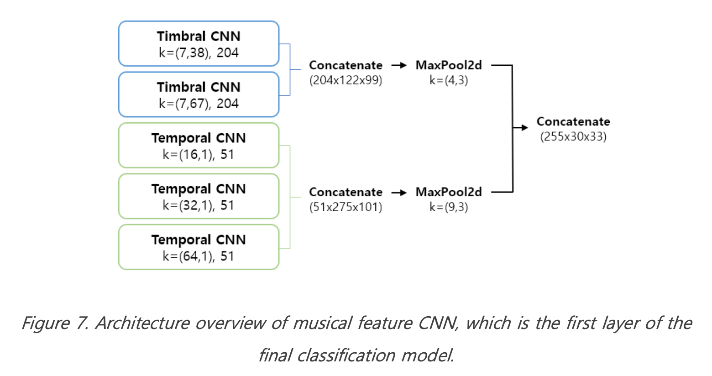

This project is based on Fall 2021 GCT 634 at KAIST

github link: [https://github.com/YoonjinXD/Music-Auto-Tagging](https://github.com/YoonjinXD/Music-Auto-Tagging)

***

# SUMMARY
1. I implemented and performed related experiments to verify the improvement suggestion for the multi-label classification.
2. I implemented music-tag pair triplet dataset and sampling for music retrieval by tag.
3. I applied data augmentation, multi-channel mel-spectograms and practical searching for hyperparameters as common strategies to improve the models. 
4. To improve music tag classification, I suggested the CNN architecture for music data and applied focal loss function.
5. In retrieval problem, I mainly focused on building a triplet data sampling strategy and suggested classification-based triplet sampling. 

Through the suggested approaches, the final improved models result in 0.86% roc accuracy for classification and ({'R@1': 0.47634560692813116, 'R@2': 0.6166209464753155, 'R@4': 0.7485045429220182, 'R@8': 0.8455286622762342}) recall for retrieval. 

You can check more details in the report [here](https://github.com/YoonjinXD/Music-Auto-Tagging/blob/main/hw2_report.pdf). The approaches and detailed methods for the improvement are explained in section 2. Remained discussion and future study are summarized in section 3.

You can also check all the implementations in the uploaded notebook.

 
 

 
